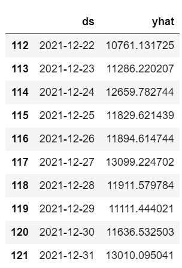
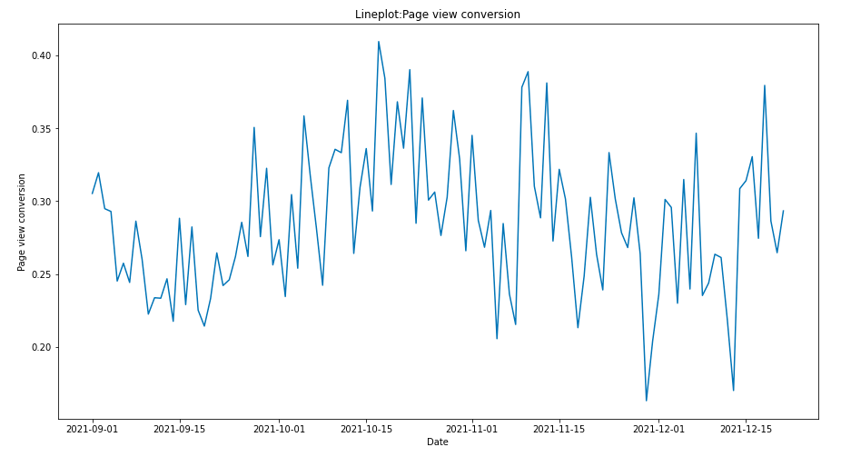
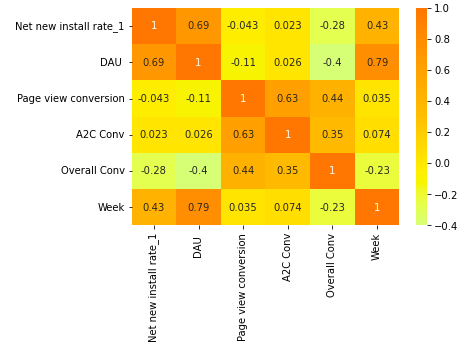

# Forcasting-with-prophet

We use python prophet library for forcasting. We use Date, and net install as dataframe input into prophet. We convert required column name to 'ds' and 'y'. Then we fit the model and made future prediction.

The plot is as follows:

The forcast for each day till december closure is as follows.

# Drop in conversion rate

From the plot we can see that our page view conversion, A2C conversion is not increasing very much. 

We use regression plot and see that our overall conversion has dipped.

# Discrepency in data

Randoml sampling revealed that net new installs column is wrong. My best assumption is that it should be new installs subtracted by uninstalls. But the number was not matching with the net installs column in the excel.

To solve it I created a new column named net new install rate_1

# Insights

Our correlation plot is as follows:

As our week progressed, net new installs increased, but overall conversion has dipped. 
A2C and page view conversion seems stagnant. But our DAU, daily active users has increased.

But more daily active users doesn't lead to page view conversion or A2C conversion. We need to solve this issue. 
Since, page view conversion is highly related to A2C conversion. We need to increase our page view conversion.
This will lead to overall conversion increase. 

